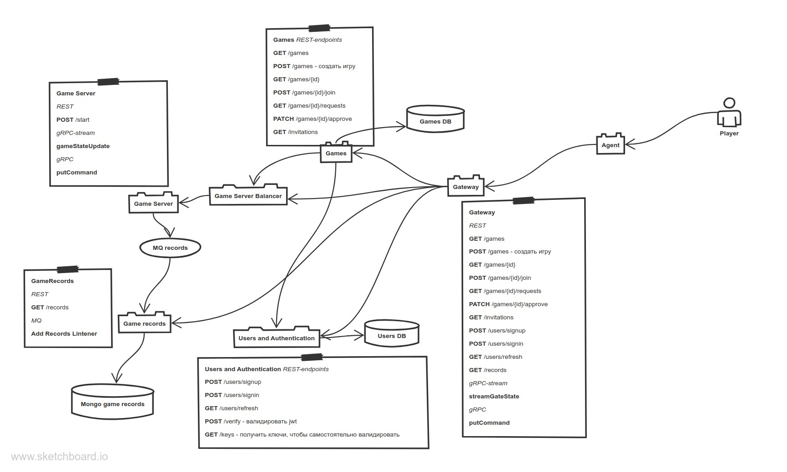

# Game Architecture

[Diagram in PNG](Game_Architecture.png)

[Sketchboard.me diagram](https://sketchboard.me/BEeyMRWFMgW)

When user needs to create game he requests `POST /games` of `Gateway` service via `Agent`. Request contains usernames of players to be invited.

User to be invited requests regularly `GET /invitations` REST-endpoint via `Agent` and once upon a time gets response with `id` of game he is invited to.

If he is not invited he can request a list of games via `GET /games` `Gateway` endpoint. Next he requests `POST  /games/{id}/join` to join. Game creator requests regularly `GET /games/{id}/requests`. If it's not empty he can approve requests via `PATCH /games/{id}/approve`.

After it's time to start the `Games` service requests `Game Server` by `POST /start` request. After this `Game Server` creates game scope, starts execution loop for current game, gets commands from users, creates and execute own commands and updates game state by them.

This time user sends regularly to server via gateway gRPC requests with control commands for his tank/spaceship. The same time it gets regularly game state update via gRPC stream `Gateway` endpoint.

Game server regularly after every update sends to `Game records` service to be stored.

To reproduce recorded game user can request `GET /records` to get game states and `Agent` display the game with it.

All requests are authenticated. So `Gateway` requests `POST /verify` endpoint to validate user JWT-token.

### Bottlenecks and Their Solutions

1. To validate user gateway needs to request `Users and Authentication` service every time itself is requested. It performs unnecessary workload on `Users and Authentication` service. To avoid it I created `GET /keys` endpoint. `Gateway` requests it regularly but not very often, stores keys and use them to validate user's JWT.
2. Saving records is very often operation. It can perform not so fast on big workload and generate problems like long latency of response, lost connections because not enough threads and so on. To avoid these problems I decided to send event messages asynchronously using MQ (Kafka, Rabbit, etc). Also storage for them is not relational. For example Mongo.
   
   If workload increases, we can distribute shards and service instances.
3. `Game server` can have large amount of clients, so it needs to process requests fast. As far as JSON parsing is not fast, I decided to make control command endpoint not REST but gRPC. It must be synchronously, so we shouldn't use MQ there. 

   If client amount and workload grows, so we can distribute this server instances and put `Game Server Balancer` before `Game Server`. It will determine by `Game Id` where to pass request. Nginx supports gRPC for load balancing, so it seems to be ok. In case we can't balance gRPC stream, maybe need to use MQ there instead.

   To make every interaction faster `putCommand` gRPC endpoint is requested only if some command is evaluated by user. At the same time, game state change in `gameStateUpdate` gRPC stream endpoint is sent as patch of current state. So it's sent only if state is changed and message is not big. 

### Requirement Changes
1. Requirements will change more often for the `Game Service` and the `Agent`. Objects of state, control commands changes. And it seems to be ok, because gateway and balancer don't depend on message or state structure.
2. Authentication requirements can be changed. In case gateway requests `POST /verify`, changes don't affect gateway. Otherwise, it does.

